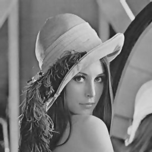

## Bilateral Filter
OpenCV bilateral filtering rewritten and annotated (only support gray scale image).

### Build
```bash
mkdir build
cd build
cmake ..
make
```

### Usage
```
Usage: bilateral_filter image_path diameter sigma_color sigma_space
bilateral_filter: bin file for current project
image_path: raw image path for processing
diameter: diameter of each pixel neighborhood
sigma_color: filter sigma in the color space
sigma_space: filter sigma in the coordinate space
```

### Run example
### Command
```bash
cd build
./bilateral_filter ./../data/Lena.jpg 5 12.0 16.0
```
### Result
<figure class="half">
    
    
</figure>
